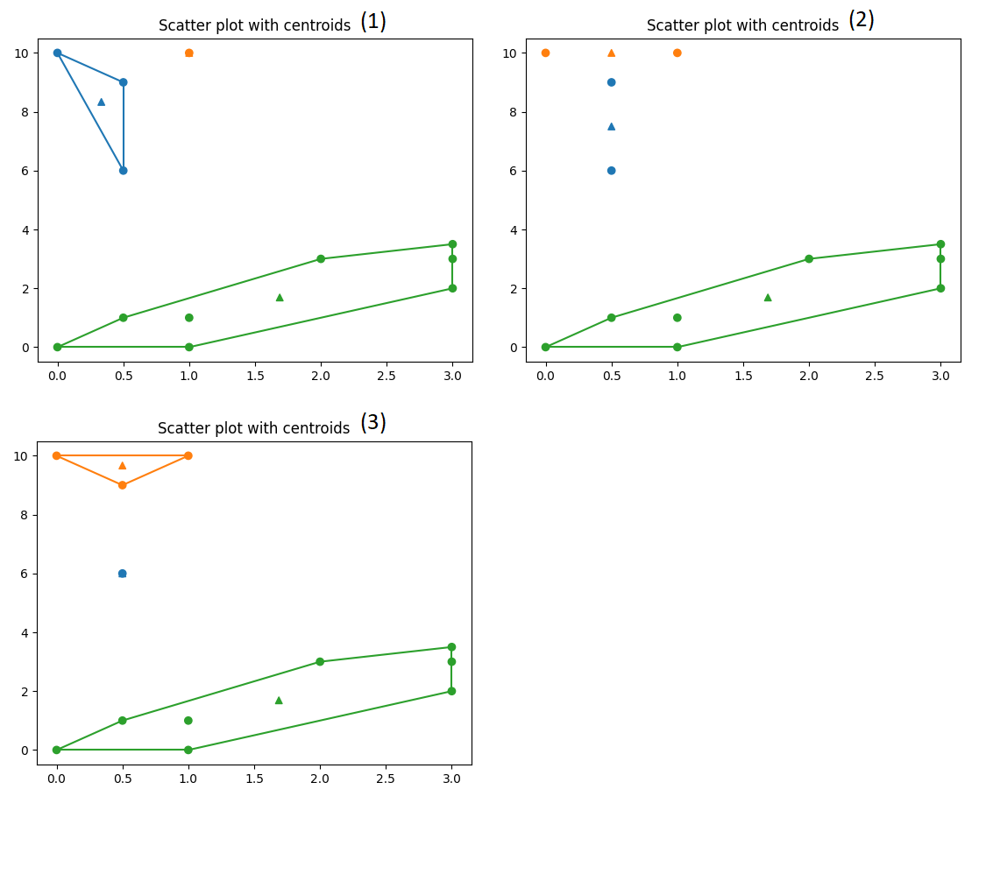

# N-dimensional K-Mean Clustering Algorithms

This code performs an unsupervised machine learning algorithm: K-Mean Clustering. 

We support any data with at least 2 dimensions, while visualization is 
available for 2 dimensional data. 

## Prerequisite

Tested on Python 3.9, but it should work on any Python with version 3.X.

Numpy: For basic calculation.
Matplotlib: For visualization.
Seaborn: For color palettes.
Scipy: For convex hull calculation.

## How to use it, 2-dimensional data.

Sample 2D and 3D data are provided. 

To use 2 dimensional clustering, input your data as an (N,2)-shape numpy array in `visual_2d.py`. 
Change the number of clusters `K` if needed. 
Then run the script 
```
python visual_2d.py
```
You will see some visualizations. 

Dots are the sample points, and triangles are the centroids for the groups..

Finally, the output will show you a zero-base indexing, indicating the cluster each point belongs to, and a (K,2)-shape numpy array for the centroids. 

Here we show the iteration process



## How to use it, n-dimensional data.

To use data that is at least 3-dimensional, edit the input similarly in `calc_nd.py`. 

Currently there is no visualization for this kind of data, but we will still output the data-cluster relation as a zero-based index, and the list of centroids. 